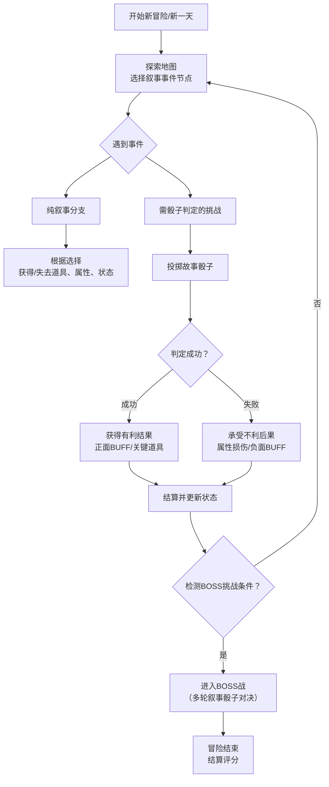

## **《租房大冒险》开发细节规划文档**

### **一、核心循环设计**
游戏的驱动力在于：**通过叙事选择推动进程，用骰子判定增加随机与策略，用属性和道具应对挑战**。


### **二、核心机制详述**

#### **1. 叙事与交互**
*   **形式**：每个事件以“手绘场景插画 + 幽默叙事文本 + 2-4个选项按钮”呈现。
*   **内容类型**：
    *   **遭遇**：与室友、邻居、维修工、神秘租客的互动。
    *   **挑战**：维修电器、与房东周旋、对付蟑螂。
    *   **探索**：发现“隐藏隔断”、“神秘阁楼”、“二手市场”。
    *   **随机**：突如其来的检查、奇葩合租要求。

#### **2. “故事骰子”系统**
*   **本质**：将传统RPG的“属性检定”可视化、游戏化。
*   **流程**：
    1.  遇到挑战时，屏幕出现一个虚拟骰子（如六面）。
    2.  **基础成功率** = 相关属性值 × 10%。例：“说服房东”看`口才`，“自己修马桶”看`动手`。
    3.  玩家点击“投掷”，骰子滚动。
    4.  **判定**：
        *   **大成功（骰点≥95）**：超额完成，有额外奖励。
        *   **成功（骰点 ≤ 成功率）**：顺利通过。
        *   **失败（骰点 > 成功率）**：勉强完成但有代价。
        *   **大失败（骰点≥失败阈值）**：搞砸了，遭遇灾难性后果。

#### **3. 属性系统**
*   **核心属性（可视化为“租客状态栏”）**：
    *   `口才`：用于谈判、说服、砍价。
    *   `动手`：用于维修、组装、自制。
    *   `精力`：用于应对加班、赶工、熬夜。
    *   `财力`：直接等同于金钱，用于支付房租、购买道具。
    *   `心态`：类似于生命值。归零则因崩溃而“游戏结束”。
*   **成长**：通过事件成功选择、使用特定道具来提升。

#### **4. 道具与BUFF系统**
*   **道具**：
    *   **实用类**：`防狼喷雾`（战斗）、`万能扳手`（+动手）、`隔音耳塞`（防噪音）。
    *   **契约类**：`模糊合同`（可对中介使用一次）。
    *   **神秘类**：`前任租客的日记`（揭示隐藏信息）。
*   **BUFF/DEBUFF**：
    *   `房东的青睐`（下次沟通成功率+20%）
    *   `蟑螂恐惧症`（接下来3次事件心态-1）

### **三、叙事与BOSS战设计**

#### **1. 事件池结构**
*   **通用池**：日常随机事件。
*   **主题章节**：如“找房篇”、“签约篇”、“居住篇”。
*   **Boss关联事件**：触发和推进Boss战的关键事件。

#### **2. BOSS战：黑心中介**
*   **特点**：出现在游戏中期，代表“契约与金钱的陷阱”。
*   **战斗形式**：多轮“合同谈判”叙事对决。
    *   每一轮，中介抛出霸王条款（如“押一付六”、“物业费自理”）。
    *   玩家需运用`口才`（驳斥）、`财力`（妥协）、或使用道具`模糊合同`（转移话题）来应对。
    *   每失败一轮，损失`财力`或签订不利条款（永久DEBUFF）。
    *   胜利条件：撑过5轮，或`口才`检定累计成功3次。

#### **3. BOSS战：终极房东大妈**
*   **特点**：游戏最终Boss，代表“权威与规则的化身”。
*   **战斗形式**：在“退房检查”中生存。
    *   房东会依次检查“墙面”、“家具”、“卫生”。
    *   玩家需根据检查项，选择用`动手`技能现场修复，或用`口才`找借口，或使用道具（如`全新墙漆`）直接通过。
    *   Boss有“怒气值”，玩家失败会累积其怒气。怒气满，房东直接扣除全部押金，游戏失败。
    *   胜利条件：通过所有检查项，保住押金。

### **四、技术实现建议**
1.  **引擎/框架**：推荐 **Pixi.js** 或 **Phaser 3**。它们轻量、性能好，非常适合2D点击叙事+H5。
2.  **数据结构**：
    *   **事件表**：用JSON存储所有事件，包含ID、文本、选项、成功率、结果分支等。
    ```json
    {
      "id": 103,
      "text": "深夜，隔壁传来诡异的敲墙声...",
      "options": [
        {"text": "敲回去！", "check": "bravery", "value": 70, "success": 104, "fail": 105},
        {"text": "戴上耳塞睡觉", "result": "gain_item:earplugs"}
      ]
    }
    ```
    *   **玩家状态**：一个实时更新的状态对象，保存所有属性、道具、BUFF。
3.  **美术与音频**：
    *   **美术**：统一的手绘或矢量漫画风格。需要大量表情立绘（房东、中介）和场景。
    *   **音频**：准备点睛的点击音效、骰子滚动音效、成功/失败提示音、环境BGM。

### **五、开发里程碑**
1.  **原型阶段**：完成核心循环（1个完整叙事事件 + 骰子判定 + 属性变化）。
2.  **内容填充**：构建包含30-50个事件的通用事件池，实现道具系统。
3.  **Boss实现**：完成两个Boss的叙事战斗流程。
4.  **打磨与测试**：调整平衡性（骰子概率、属性成长），加入更多幽默文本和彩蛋。
5.  **发布准备**：适配移动端H5，优化加载速度。
